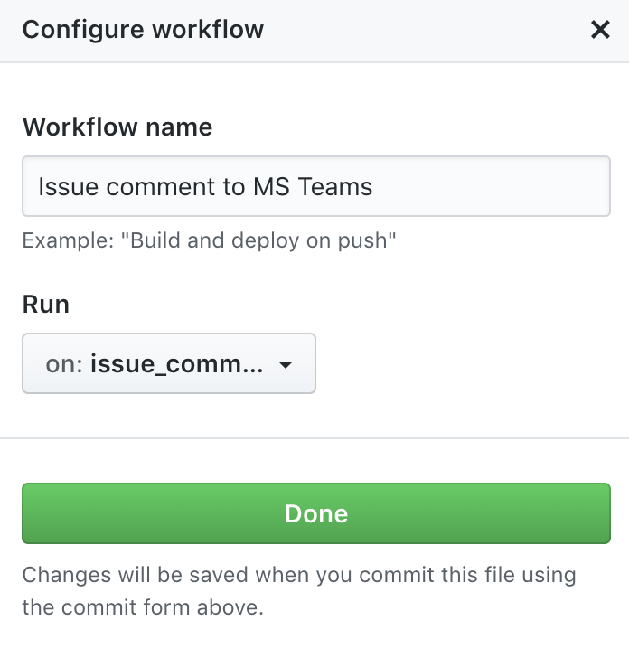
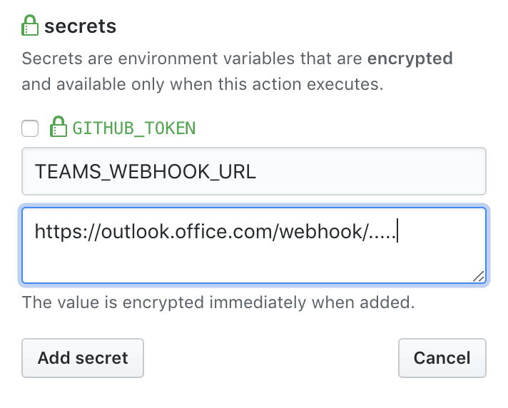
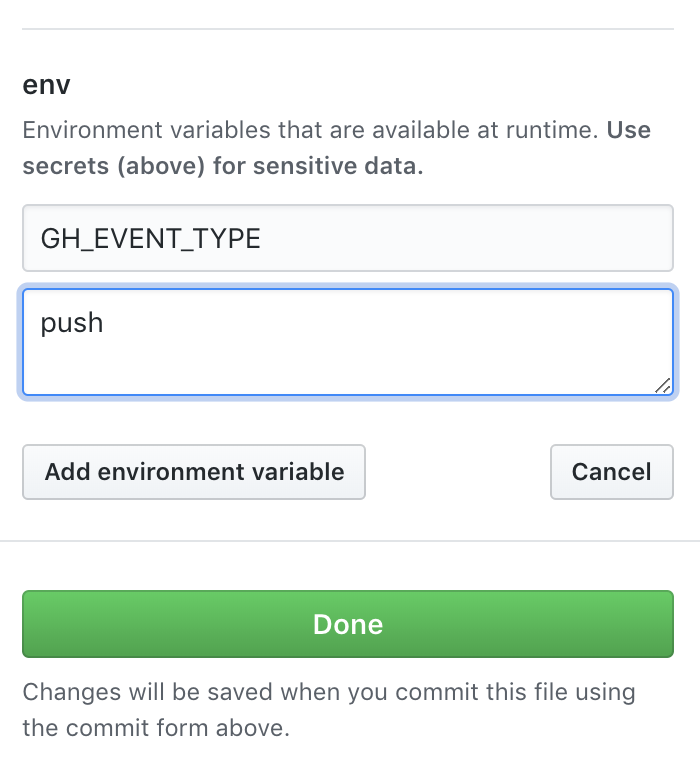
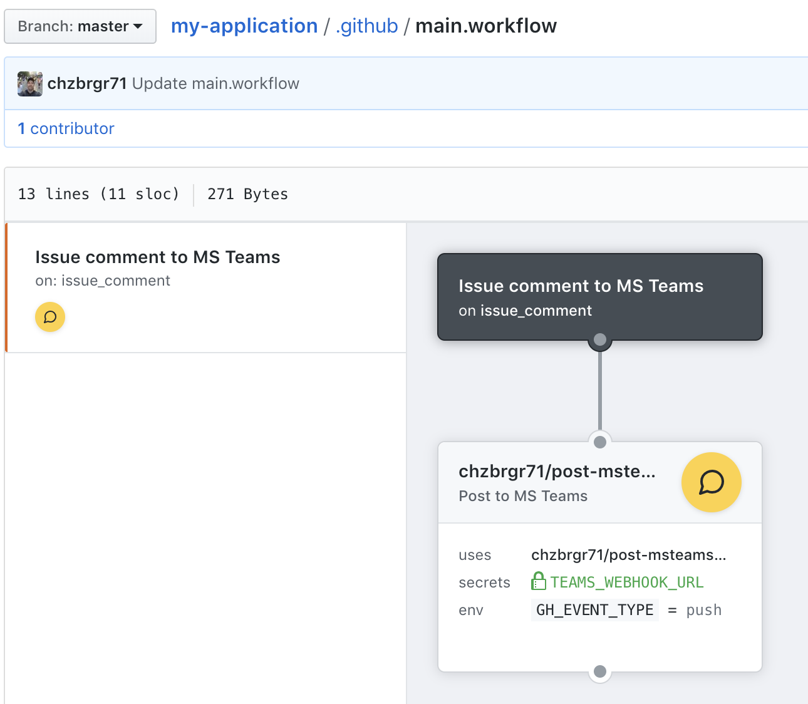

## post-msteams

This repo contains a re-usable GitHub Action that when installed will post to Microsoft Teams details about GitHub issue comments.

This Action makes use of https://github.com/rveachkc/pymsteams for the Python code for Teams.

## Pre-requisites

To run this action you'll need:
 - To be part of the [Actions beta](https://github.com/features/actions). Note that during the beta, Actions will only run on private repositories.
 - A Microsoft Teams account.
 - Teams webhook "Incoming Webhook" added to the channel of your choice. This will provide a URL that will be added to the GitHub workflow as a secret. https://docs.microsoft.com/en-us/outlook/actionable-messages/actionable-messages-via-connectors 

## Setup

> Note: This action currently supports a few specific GitHub events: push, issue, issue comment, and pull request. The type must be specified in a env variable in step #2.

### 1. Create the release workflow

Add a new workflow to your `.github/main.workflow` to trigger on `issue_comment`.



### 2. Create the Action

Create an action that uses this repository `chzbrgr71/post-msteams@master` or points to Docker Hub at `docker://chzbrgr71/post-msteams`

In the Action, create a secret called `TEAMS_WEBHOOK_URL` with your specific url to the Teams Channel:



Add an event type environment varable called `GH_EVENT_TYPE`. As of now, this variable can be set to:
- push
- pull_request
- issue_comment
- issue



### 3. Commit the changes

Make sure you commit all pending changes. After you've done that your `main.workflow` should look similar to this:

```
workflow "Issue comment to MS Teams" {
  on = "issue_comment"
  resolves = ["chzbrgr71/post-msteams@master"]
}

action "chzbrgr71/post-msteams@master" {
  uses = "chzbrgr71/post-msteams@master"
  secrets = ["TEAMS_WEBHOOK_URL"]
  env = {
    GH_EVENT_TYPE = "push"
  }
}
```

On the visual editor it should look similar to this:



### 4. Test the workflow!

Create an Issue in your repository and add a comment. You should now see a post to your Teams channel!

## Local testing

The postmessage.py is the main program. You must set the below env var to run locally: `python postmessage.py`

```
TEAMS_WEBHOOK_URL=https://outlook.office.com/....
```

If you prefer to test the container directly (which is a tiny bit slower but more reliable) you can just run something like:

```
docker build -t repo/post-msteams:latest .
```

## Pull Requests and Issues are Welcome

Feel free to share your ideas.

:octocat::heart:


